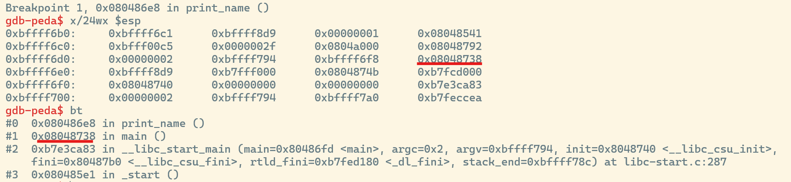
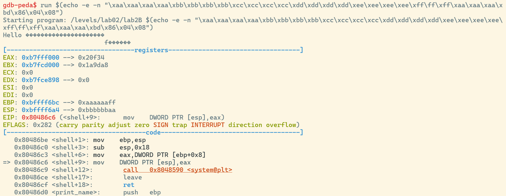
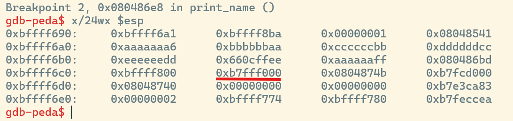

# lab2B.c analysis
The program gives us the requirement to pass 1 argument. When we run it, it prints what we´ve entered as the argument in the console.

## int main()
This signals to us that exactly one argument is supposed to be passed, when executing the binary.
```c
if(argc != 2)
{
    printf("usage:\n%s string\n", argv[0]);
    return EXIT_FAILURE;
}
```
After that, we call the `print_name()` function with argv[0] as a parameter and the program exits.

## void print_name
The function creates an array with the length of 15 and uses `strcpy()` to fill the array. After that it prints the array.
```c
char buf[15];
strcpy(buf, input);
printf("Hello %s\n", buf);
```
## void shell()
This function will start a shell if we pass '/bin/sh' as the parameter. Our goal will be to call this function.
# Finding the buffer overflow
If someone knows one vulnerable c function, it is `strcpy()`. Since there is not much happening apart from that, we can be quite confident, that this will be our target. 
## Finding a buffer overflow in strcpy()
The content we copy over is passed by us via argument. But if you´ll take a look in the code the length is never checked. Hence we can pass an array as large as we want to argv. This argv is then copied over to our array with the length of 15 bytes. So if our argv array is longer than 15 characters, we´ll continue overwriting the stack that comes after the 15 bytes.
## exploiting strcpy()
Our end goal is to call the `shell()` function.
> !! A function can be called from different places in the code. To know from which place the function was called the return address will be stored on the stack. By overwriting this address to the address of the `shell()` function after we´ll jump to `shell()` and not `main()` after we leave `print_name()`

> !! This challenge is done with a 32-bit executable. If it would´ve been done with 64-bit executable the sizes might change.

Our first step should be finding the return address that we want to overwrite. For that we´ll set a breakpoint after the call of `strcpy()` and search where in the stack the address matches with the one from our backtrace to `main()`.



After that we´ll count how many bytes we´ll need to enter to reach the return address. In my case it is 26 bytes. After the 26 bytes the pointer address of our `shell()` function can be entered.

We find the pointer address from `shell()` by entering the following command in gdb:
> info functions

When we´d run the payload we´ve build so far it would enter the `shell()` function, but it would still not work.
>  run $(echo -e -n "\xaa\xaa\xaa\xaa\xbb\xbb\xbb\xbb\xcc\xcc\xcc\xcc\xdd\xdd\xdd\xdd\xee\xee\xee\xee\xff\ff\xff\xaa\xaa\xaa\xbd\x86\x04\x08")

We can set a breakpoint before the system-call has been made to check with what is being passed into the system call.


The important register is eax since this is where the pointer is stored that should point to the string '/bin/sh'

To make the system call work, we can replace the pointer that is currently in eax with the pointer to the '/bin/bash' string, since the string already exists on the stack. To find the string use any reverse engineering program and search for the strings. For my executable, the string was at ``0x80487cf``.

To figure out where we have to replace the `0xb7fff000`, we have to go back to our first break point at after the `strcpy()` and find the address in which the pointer is stored.


Now we only have to add the extra bytes of random irrelevant input till we reach that address and then enter our desired pointer.

>./vulnerableCode $(echo -e -n "\xaa\xaa\xaa\xaa\xbb\xbb\xbb\xbb\xcc\xcc\xcc\xcc\xdd\xdd\xdd\xcf\x87\x04\x08\xee\xff\ff\xff\xaa\xaa\xaa\xbd\x86\x04\x08\xaa\xaa\xaa\xaa\xd0\x87\x04\x08")